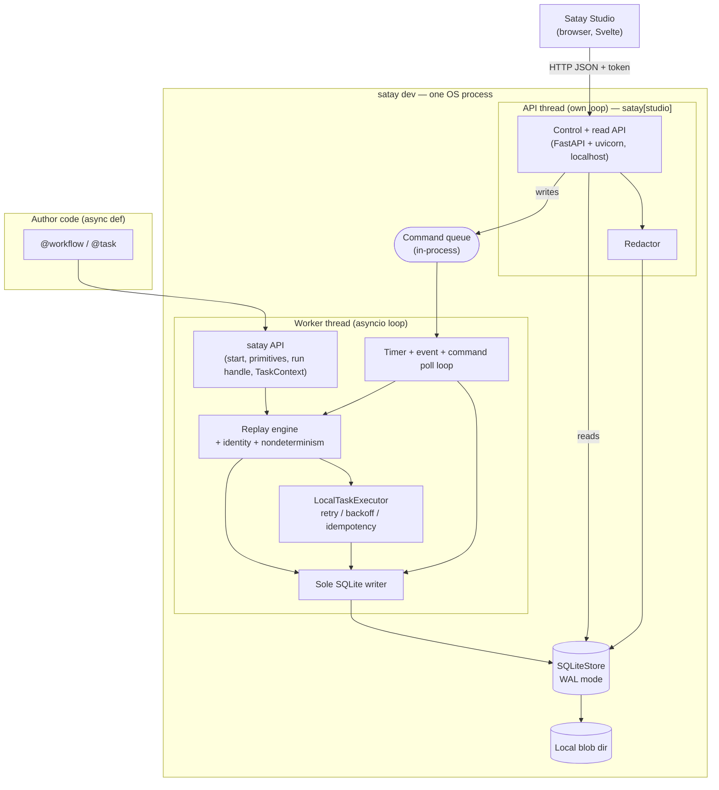

# Satay Runtime — Architecture

> Technical architecture specification, first pass. Produced 2026-07-20 from
> `CONTEXT.md`, `docs/PRD.md`, `BREADBOARD.md`, `SLICES.md`, and `docs/adr/*.md`,
> using the architecture template at
> `github.com/timajwilliams/architecture`. Everything the ADRs already decided is
> carried in as fixed; everything else is a **first-pass default** to be grilled in
> steps G2/G3 and promoted to an ADR once confirmed. The status of each choice is
> tracked in §12.

Scope is the MVP (decision D-scope): the durable runtime, its five primitives,
SQLite persistence, the control and read API, Satay Studio, and the two-task
crash-recovery slice. The vendor-dossier reference app is the next milestone and is
out of scope here.

---

## 1. Project structure

Single package plus a small frontend, in one repository. The runtime core is pure
Python with a near-zero dependency surface; the debugger stack (the API server plus
the built Studio bundle) ships in a **`satay[studio]` extra**, not the core wheel
(ADR-0013).

```
satay/
  pyproject.toml            # hatchling build backend; deps; tool config
  src/satay/
    __init__.py             # public surface: workflow, task, start, sleep,
                            #   wait_for_event, send_event, map, gather,
                            #   start_child, TaskContext, run handle
    api/                    # decorators, run handle, TaskContext, primitives   (A1, N1-N5)
    replay/                 # replay engine, identity resolver, nondeterminism   (A2, N6/N7/N9)
    journal/                # event model, Store interface, SQLiteStore, codec   (A3, N8/N12)
    executor/               # TaskExecutor, LocalTaskExecutor, retry/backoff     (A4, N10/N13/N14)
    timers/                 # timer + event poll loop, event inbox               (A5, N11)
    control/                # HTTP control+read API (own thread), redactor, cmd queue (A7/A8, N15/N16/N18)
    versioning/             # code-version stamper + mismatch policy             (A10, N17)
    blobs/                  # payload spill to local files                       (A3.4, N19)
    devstack/               # satay dev orchestrator (worker+store+API+Studio)   (A9, N20)
    testing/                # fault-injection hook, manual clock, temp-store fixtures (ADR-0011)
    cli/                    # core: argparse `satay runs show`; `satay dev`+Typer in satay[studio] (U1)
    _studio_assets/         # built Studio bundle (CI-built), shipped in satay[studio]
  studio/                   # Studio frontend source (Svelte + Vite + TS)        (U2-U8)
  tests/
    e2e/                    # public-API crash-recovery suites through the seam
    integration/            # component-boundary tests
    unit/                   # codec, key derivation, backoff, etc.
  docs/                     # FRAME, CONTEXT, PRD, SHAPING, BREADBOARD, SLICES,
                            #   SLICE-V*, ARCHITECTURE (this file), adr/
```

The module boundaries mirror the shaping parts A1-A10 and the breadboard
affordances, so a slice maps to a small set of directories. The `testing/` module
is first-class, not a test helper, because the fault-injection hook and manual
clock are runtime affordances (ADR-0011).

---

## 2. High-level system diagram

One operating-system process for the whole local stack (ADR-0007/0009/0012), split
across two threads. The **worker thread** runs the asyncio loop that drives
workflows: the `satay` API surface, the replay engine, the executor, the timer loop,
and the **sole SQLite writer**. The **API thread** runs its own loop with the
FastAPI + uvicorn server; it **reads SQLite directly** through read-only connections
and **routes every write to the worker over an in-process command queue**. Studio is
a browser app talking to the API thread over localhost.



The debugger never blocks on the worker: reads go straight to SQLite over WAL
read-only connections, so a busy or stalled worker cannot freeze Studio. Every write
(start, cancel, send_event, fork) is enqueued on the command queue and applied by the
worker, which stays the single writer; the worker's poll loop is what turns queued
commands and due timers into journal events. There is one write path and one read
path, and the journal is the only shared truth between the threads.

---

## 3. Core components

Each component names its responsibility and its committed technology. Component IDs
trace to `SHAPING.md` (A#) and `BREADBOARD.md` (N#/U#).

### 3.1. Author-facing API and decorators (A1)

The surface a developer imports: `@satay.workflow`, `@satay.task`, `satay.start`,
the five primitives, the run handle, and `TaskContext`. Its whole job is to look
like ordinary async Python while routing every durable call through the replay
engine. Stack: pure Python 3.12+, `typing`/`inspect` for signature and
return-annotation capture, no third-party dependency.

### 3.2. Replay engine (A2)

Re-runs a workflow top-to-bottom on each drive, intercepts durable calls, resolves
identity by call-site ordinal plus task name (or explicit `key=` for fan-out), and
consults the journal: a hit returns the recorded result, a miss schedules execution.
It raises `NondeterminismError` on divergence. Stack: pure Python asyncio. This is
the heart of the system and has no external dependency by design.

### 3.3. Journal, codec, and persistence (A3)

Owns the append-only event log and its serialization. The codec is JSON-compatible
with tagged datetimes, timedeltas, enums, and blob references, and it rehydrates
results from return annotations. Stack: stdlib `json` for encoding; **Pydantic is
duck-typed, not a core dependency** (rehydration calls `model_validate` only when the
declared return type provides it, ADR-0013); and a `Store` interface with a
**SQLite** implementation driven by a **dedicated writer thread over stdlib
`sqlite3`** in **WAL mode**, so the worker is the single writer while Studio and the
API read through separate read-only connections (ADR-0012). `seq` is allocated per
run inside the append transaction, on the writer thread. Pragmas are set by hand:
`journal_mode=WAL`, `synchronous=NORMAL` on the append path, and a real
`busy_timeout`. `aiosqlite` stays the fallback to benchmark against before the driver
is finally locked. Events are modeled as **stdlib frozen dataclasses** and persisted
via **raw parameterized SQL** (no ORM); the schema is versioned with `PRAGMA
user_version` and migrated forward on open (ADR-0016, ADR-0017).

### 3.4. Task execution (A4)

The `TaskExecutor` interface and its only MVP implementation, `LocalTaskExecutor`,
which runs a task coroutine on the loop, applies retry with exponential backoff and
jitter, derives the idempotency key, and injects `TaskContext`. Stack: pure Python
asyncio, with backoff timing driven through the injected clock so it is testable.

### 3.5. Timers and events (A5)

Persists timer rows and an event inbox, and runs the poll loop (about 1s in dev)
that fires due timers and delivers events, resuming waiting runs. Stack: an asyncio
background task over the store, using the same injected clock as the executor.

### 3.6. Control and read API (A7/A8)

An HTTP server on its **own thread** (not the worker loop), exposing the write
endpoints (`start`, `status`, `cancel`, `send_event`, `fork`) and the read endpoints
(run list, timeline, tree, task/attempt detail, compare). Stack: **FastAPI on
Starlette**, served by **uvicorn** run in the API thread, with **Pydantic v2**
response models that pin the JSON contract Studio depends on. Reads hit SQLite
directly over read-only connections; writes are enqueued on the in-process command
queue and applied by the worker (ADR-0012). The redactor is a read-time transform
applied to every response, and the surface is guarded by a per-session token plus an
`Origin`/`Host` allow-list (ADR-0014). The whole stack ships in the `satay[studio]`
extra, not the core (ADR-0013). FastAPI emits OpenAPI, but the JSON contract is unversioned
in the MVP since the server and Studio ship together (ADR-0018).

### 3.7. Satay Studio (U2-U8)

The local web debugger. The **MVP ships four views**: run list, timeline with the
interruption marker, execution tree, and task detail with attempts and usage. Fork,
compare, and the version-mismatch banner are deferred (ADR-0013). Stack: **Svelte +
Vite + TypeScript**, built as a plain SPA, with the timeline and tree drawn using a
framework-neutral library (d3). The bundle is prebuilt in CI and served by the API
thread from the `satay[studio]` extra (ADR-0013). Studio is a pure consumer of the
read API and holds no state of its own. Per ADR-0011 the MVP verifies Studio through
the JSON API, not through UI-rendering tests, so the frontend stays deliberately
lean; **Vitest** covers any frontend unit tests. Studio is **Svelte 5 (runes)** built
with **pnpm** and a pinned Node LTS, styled with plain CSS and minimal routing, and it
**polls the read API** for freshness (no push in the MVP) (ADR-0018).

### 3.8. Versioning and effect safety (A10)

Stamps each run with a code version (git commit, then dev string, then source hash)
and enforces the mismatch policy on resume, plus the `effect_safety` checks on
retryable side-effecting tasks. Stack: pure Python, using the local `git` binary or
`dulwich` when available and falling back to a source hash otherwise.

### 3.9. CLI and dev orchestrator (A9, U1)

`satay dev` boots the worker (its asyncio loop) plus the control API (its own thread)
and serves Studio; `satay runs show <id>` prints a run's timeline as text. The core
ships a **minimal `argparse` CLI** for the read-only `satay runs show`; **`satay dev`
and the `Typer` command surface live in the `satay[studio]` extra** (ADR-0016), and
`satay dev` orchestrates clean startup and shutdown of both threads and the uvicorn
server.

---

## 4. Data stores

### 4.1. SQLite (primary durable store)

The single source of durable state, in WAL mode for concurrent read while the single
writer appends. Driver: a **dedicated writer thread over stdlib `sqlite3`**
(benchmarked against `aiosqlite` before the final lock), WAL mode (ADR-0012). Tables
(fields finalized per slice):

- `runs`: `run_id`, `workflow_name`, `status`, `code_version`, `created_at`,
  `idempotency_key?`. Indexed on `idempotency_key` for keyed start (V2).
- `events`: `run_id`, `seq`, `event_id`, `type`, `ts`, `payload_json`, primary key
  `(run_id, seq)`. The append-only journal (V1).
- `timers`: `run_id`, `timer_id`, `fire_at`, `kind`, `durable_call_identity`,
  `status`. Polled by the timer loop (V3).
- `events_inbox`: `run_id?`, `event_type`, `key`, `payload_ref`, `received_at`,
  `consumed`. Buffers events that may arrive before their wait (V3).

The database and blob directory live under a project-local `./.satay/` by default,
overridable with `--data-dir`; the schema is versioned with `PRAGMA user_version` and
migrated forward on open, refusing a DB written by a newer `satay` (ADR-0017).

SQLite is the MVP default; PostgreSQL is the first production backend post-MVP,
behind the same `Store` interface. Redis is explicitly not the durable store
(CONTEXT).

### 4.2. Local blob directory (payload spill)

A local filesystem directory holding payloads over the inline threshold (about
256 KB, tunable), referenced from the journal by a blob id (V8). In dev this is a
directory under `./.satay/` (the data dir, ADR-0017); a future object-store backend
fits the same reference indirection.

---

## 5. External integrations and APIs

The core ships **no external integrations and no model adapters** (ADR-0008). This
is deliberate: provider SDKs (OpenAI, Anthropic, a database, an HTTP service) are
called by the developer's own task code, and usage reaches the journal only through
`ctx.record_model_usage(...)`, which writes a schemaless usage slot. The runtime
never imports a provider SDK.

The one API the project itself exposes is the local HTTP control and read API (§3.6),
consumed by Satay Studio and by external callers on localhost.

---

## 6. Packaging, distribution, and CI

Satay is a local-first library, so there is no cloud deployment tier for the MVP.
"Deployment" here means distribution and the local run.

- **Lean core vs. studio extra (ADR-0013):** `pip install satay` yields the
  pure-Python runtime with a tiny dependency surface (no Pydantic/FastAPI/uvicorn in
  the core). `pip install satay[studio]` adds the debugger: FastAPI + uvicorn, the
  Pydantic response models, and the built Studio bundle. Applications embedding Satay
  do not ship a JS SPA to production.
- **Build backend:** hatchling, configured in `pyproject.toml`. The Svelte + Vite
  bundle is **prebuilt in CI** and vendored into the `satay[studio]` wheel as data
  files; it is never built at `pip install`, and the sdist does not require Node.
- **Distribution:** PyPI (sdist + wheel). Package and CLI name `satay`; provisional
  pending PyPI/domain/trademark checks. License Apache-2.0. Python 3.12+.
- **Local run:** `satay dev` for the full stack; `satay runs show` for read-only
  inspection. No server, scheduler, or broker to deploy.
- **Environment and tooling (ADR-0015):** `uv` for environment and dependency
  management; Ruff for lint/format; mypy strict; pytest + `pytest-asyncio`; Vitest for
  frontend unit tests.
- **CI & release (ADR-0019):** GitHub Actions runs lint, type-check, and the test
  suites on **Python 3.12 and 3.13**, and builds the Studio bundle (pinned Node LTS +
  pnpm) for packaging. Publishing to PyPI uses **OIDC trusted publishing** (no
  long-lived tokens).

Post-MVP, a PostgreSQL backend and a multi-worker `TaskExecutor` would introduce a
real deployment story; that is future work (§9).

---

## 7. Security considerations

- **No pickle anywhere** (ADR-0005). All durable data is JSON-compatible, which
  removes arbitrary-code-execution-on-load risk and keeps the journal inspectable.
- **Localhost surface with auth-lite guards (ADR-0014).** The control and read API
  binds to loopback on a random port. Because a browser tool on a predictable
  localhost port is exposed to CSRF and DNS-rebinding, `satay dev` also issues a
  per-session token that Studio must present on every request, and allow-lists
  `Origin`/`Host`. This is not authentication for a networked deployment; exposing the
  API to a network would still need real auth at the API layer, which is out of scope.
- **Redaction (N18).** Configured sensitive fields are stripped on every read path,
  so inspecting a run in Studio does not leak credentials that a task recorded in its
  input or output.
- **Effect safety (A10.2).** `effect_safety=strict` refuses to run a retryable
  side-effecting task that has not declared an idempotency or compensation strategy,
  which is a safety control rather than a security boundary but belongs in the same
  discussion.
- **Secrets in tasks.** Provider keys live in the developer's task code and
  environment, never in the runtime; the runtime only sees what a task returns or
  records, which the redactor then filters.

---

## 8. Development and testing environment

The primary test seam is the public API driving real workflows against a temporary
SQLite store, with the fault-injection hook and the manual clock injected (ADR-0011).
Every slice's `## Test Plan` conforms to it.

- **Test runner:** pytest with `pytest-asyncio` for async tests (ADR-0015).
- **Store under test:** a temp-file or `:memory:` `SQLiteStore` from the `testing/`
  fixtures.
- **Determinism controls:** the manual clock advances virtual time for sleep and
  timeout tests; the fault-injection hook aborts after a chosen journal event.
- **Lint and format:** Ruff.
- **Type checking:** mypy, run in strict mode over `src/satay` (ADR-0015).
- **Frontend:** the Studio bundle builds with Vite; its behavior is asserted through
  the read-API payloads, not through browser rendering, in the MVP. **Vitest** covers
  any frontend unit tests.
- **Coverage & property tests (ADR-0019):** `pytest-cov` in CI; `hypothesis` is an
  optional dev dependency for the codec and idempotency-key derivation.
- **Platforms (ADR-0019):** Linux and macOS first-class, Windows best-effort; SQLite
  on local disk only, not network filesystems.

---

## 9. Future considerations and roadmap

The two seams introduced on day one, the `Store` interface and the `TaskExecutor`
interface, exist so that distribution arrives additively: as new implementations
rather than a rewrite. The public API (`@workflow`, `@task`, the five primitives),
the journal event model, and the event-sourced replay semantics all sit above both
seams and stay constant across every phase below.

### Phased roadmap

1. **Durable on SQLite (the MVP).** `SQLiteStore` behind the `Store` seam and
   `LocalTaskExecutor` behind the executor seam, in one process. Proves the
   durable-execution property with zero external infrastructure.
2. **Durable on PostgreSQL.** A `PostgresStore` behind the same `Store` seam: a
   shared database that survives across processes and machines, and the first real
   deployment story. Postgres `LISTEN/NOTIFY` can replace the ~1s poll loop with push
   delivery of events and timers, without changing the API contract (ADR-0009). Still
   a single worker.
3. **Multi-worker execution.** Several worker processes pulling from the same
   Postgres store, behind a second `TaskExecutor` implementation. This needs atomic
   task claiming (`SELECT ... FOR UPDATE SKIP LOCKED`), leases and heartbeats so a
   crashed worker's runs are recovered, and genuine concurrent writers. It is the
   point where Postgres earns its keep and SQLite cannot follow.

### Other future work

- **Replay cost scales with journal length.** Event-sourced replay re-runs a workflow
  from the top on each drive, reusing recorded results, so cost grows with the number
  of durable calls in a run. This is irrelevant at MVP scale; if it ever bites, add
  decoded-result memoisation within a process's lifetime (and, later, continuation
  snapshots). It does not change ADR-0001.
- **Static-analysis linter** for workflow bodies as an author-time aid, on top of the
  runtime nondeterminism check (ADR-0003).
- **Optional model-adapter libraries** as separate packages, never a core dependency
  (ADR-0008).
- **A TUI debugger** behind the same JSON API seam (ADR-0009).
- **The vendor-dossier reference app**, the next milestone after this runtime.

---

## 10. Project identification

- **Project:** Satay Runtime (name provisional).
- **Repository:** local working copy at `abang-ai/satay` (public repository URL
  pending).
- **Owner / contact:** Jian (leejianrong2@gmail.com).
- **Last updated:** 2026-07-20.

---

## 11. Glossary and acronyms

The canonical glossary is in `CONTEXT.md` and is not duplicated here; use those terms
exactly. Stack terms introduced by this document:

- **WAL:** SQLite write-ahead logging mode, which allows concurrent readers during a
  write and suits the single-writer, many-reader (Studio) shape.
- **ASGI:** the async server interface FastAPI/Starlette implements and uvicorn
  serves.
- **Wheel / sdist:** the built and source distribution formats published to PyPI.
- **Store seam:** the `Store` interface that isolates SQLite today from PostgreSQL
  later.
- **Executor seam:** the `TaskExecutor` interface that isolates `LocalTaskExecutor`
  today from a multi-worker executor later.
- **Command queue:** the in-process queue the API thread uses to hand writes to the
  worker, which stays the single writer (ADR-0012).
- **`satay[studio]` extra:** the optional install that adds the debugger stack
  (FastAPI + uvicorn + the built Studio bundle) on top of the lean core (ADR-0013).

---

## 12. Technology decisions: status for grilling (G2/G3)

The split G2/G3 should attack. "Decided" choices are backed by an ADR and should only
be reopened with cause. "Proposed" choices are this pass's defaults and are the
intended targets of the tech-stack grill.

| Area | Choice | Status | Basis / to confirm |
|------|--------|--------|--------------------|
| Language | Python 3.12+ | Decided | D-python |
| Concurrency | asyncio, single process, async-only | Decided | ADR-0007 |
| Execution model | Event-sourced replay | Decided | ADR-0001 |
| Durable store (MVP) | SQLite | Decided | ADR-0007, CONTEXT |
| Serialization | JSON-compatible, no pickle | Decided | ADR-0005 |
| API/worker co-hosting | Separate API thread; reads direct, writes via command queue to the sole worker writer | Decided | ADR-0012 |
| SQLite driver | Dedicated writer thread over stdlib `sqlite3` (benchmark vs `aiosqlite`) + WAL | Decided | ADR-0012 |
| Typed models / rehydration | Duck-typed Pydantic (optional), stdlib-first codec | Decided | ADR-0005, ADR-0013 |
| HTTP framework | FastAPI + uvicorn, on its own thread, in `satay[studio]` | Decided | ADR-0012, ADR-0013 |
| Local-surface security | Loopback + random port + session token + `Origin`/`Host` allow-list | Decided | ADR-0014 |
| CLI framework | argparse core CLI; Typer + `satay dev` in `satay[studio]` | Decided | ADR-0016 |
| Studio frontend | Svelte + Vite + TypeScript (plain SPA); d3 for timeline/tree | Decided | ADR-0013 |
| Studio MVP scope | Four views (run list, timeline, tree, task detail); fork/compare/version-banner deferred | Decided | ADR-0013, PRD |
| Frontend packaging | Prebuilt in CI, shipped in the `satay[studio]` extra | Decided | ADR-0013 |
| Build backend | hatchling | Decided | ADR-0015 |
| Env / deps | uv | Decided | ADR-0015 |
| Lint / format | Ruff | Decided | ADR-0015 |
| Type checker | mypy (strict) | Decided | ADR-0015 |
| Frontend tests | Vitest | Decided | ADR-0013, ADR-0015 |
| DB access | Raw parameterized SQL over stdlib `sqlite3` (no ORM) | Decided | ADR-0016 |
| Event model | Stdlib frozen dataclasses (msgspec only if needed) | Decided | ADR-0016 |
| Data directory | Project-local `./.satay/` (`--data-dir` override) | Decided | ADR-0017 |
| Schema migrations | Hand-rolled, keyed on `PRAGMA user_version` | Decided | ADR-0017 |
| Frontend versions | Svelte 5 (runes), pnpm, pinned Node LTS | Decided | ADR-0018 |
| Studio liveness / API | Polls the read API (no push in MVP); OpenAPI, unversioned | Decided | ADR-0018 |
| Frontend CSS / routing | Plain CSS / CSS-modules; minimal routing | Decided | ADR-0018 |
| Supported platforms | Linux + macOS first-class, Windows best-effort; local disk only | Decided | ADR-0019 |
| Python test matrix | 3.12 and 3.13 | Decided | ADR-0019 |
| Release | GitHub Actions OIDC trusted publishing | Decided | ADR-0019 |
| Logging | stdlib `logging` under a `satay` logger | Decided | ADR-0019 |
| Retry/backoff impl | Hand-rolled via injected clock (no tenacity) | Decided | ADR-0019 |
| Coverage / property tests | pytest-cov; hypothesis optional | Decided | ADR-0019 |
| Code-version source | git binary, else source hash (dropped `dulwich`) | Decided | ADR-0015 (refines ADR-0010) |
| Blob spill backend (dev) | Local filesystem directory | Proposed | threshold ~256 KB tunable (ADR-0004) |
| Test runner | pytest + pytest-asyncio | Decided | ADR-0015 |

The three open questions this section originally raised are now resolved: the API is
co-hosted on a **separate thread** with reads direct and writes via a command queue
(ADR-0012); Pydantic is **not** a core dependency (duck-typed, ADR-0013); and the MVP
builds **four Studio views** (ADR-0013, PRD). G3 then pinned the rest of the tech
stack (ADR-0016–0019); the one remaining "Proposed" row (blob spill backend) is a
sensible default not yet challenged.
