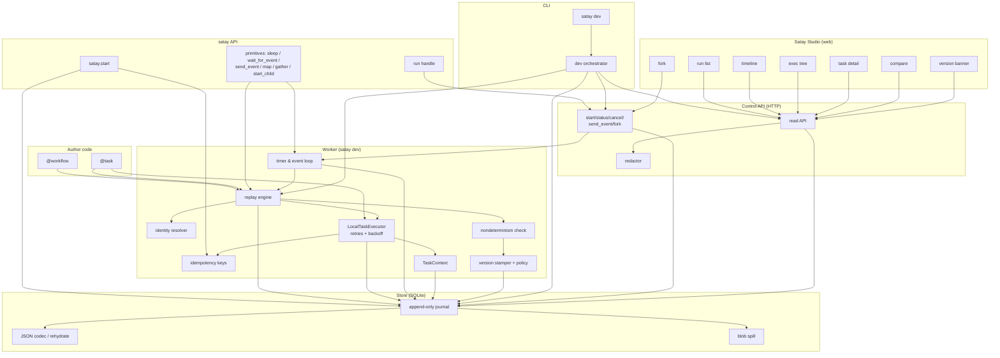

# Satay Runtime — Breadboard

Concrete affordances for Shape A (see `SHAPING.md`) and their wiring, grouped by
**Place**. Tables are the source of truth; the Mermaid diagram renders them.
Satay is mostly a runtime, so most affordances are Non-UI; the UI surfaces are
Satay Studio and the CLI.

Places: **Author code** · **`satay` API** · **Worker** · **Store** ·
**Control API** · **Studio** · **CLI**.

---

## UI Affordances

| ID | Place | Affordance | Wires Out |
|----|-------|------------|-----------|
| U1 | CLI | `satay dev` command — boots the one-process dev stack | → N20 (process orchestrator) |
| U2 | Studio | Run list (id, status, code version, start time) | → N16 (read API: list) |
| U3 | Studio | Timeline view — ordered journal events incl. interruption/resume marker | → N16 (read API: timeline) |
| U4 | Studio | Execution-tree view — parent/child, child workflows, map items | → N16 (read API: tree) |
| U5 | Studio | Task detail panel — logical task + physical attempts, inputs/outputs, native stack trace, retry reason/delay, duration, model/token/cost | → N16, → N18 (redactor) |
| U6 | Studio | Fork control — "fork from before event N" | → N15 (control API: fork) |
| U7 | Studio | Run comparison — two runs side by side | → N16 (read API: compare) |
| U8 | Studio | Version-mismatch banner on affected runs | → N16 |

## Non-UI Affordances

| ID | Place | Affordance | Wires Out |
|----|-------|------------|-----------|
| N1 | Author code | `@satay.workflow` decorator — registers a workflow definition, wraps the call to drive replay | → N6 (replay engine) |
| N2 | Author code | `@satay.task(retries=, timeout=, side_effect=)` — registers a task, wraps calls as durable calls | → N6, → N10 (executor) |
| N3 | `satay` API | `satay.start(wf, input, idempotency_key=)` — create/lookup run, return run handle | → N8 (journal: WorkflowCreated), → N13 (idempotent start) |
| N4 | `satay` API | Run handle — `result()` / `status()` / `cancel()` | → N8, → N15 |
| N5 | `satay` API | Primitives — `sleep`, `wait_for_event`, `send_event`, `map`, `gather`, `start_child` | → N6, → N11 (timers/events) |
| N6 | Worker | Replay engine — re-runs workflow, intercepts durable calls, matches journal by ordinal/`key=` | → N7 (identity), → N8 (journal), → N9 (nondeterminism), → N10 (executor) |
| N7 | Worker | Identity resolver — call-site ordinal + task name; explicit `key=` for map/gather | → N6 |
| N8 | Store | Journal — append-only event log, atomic append; source of durable state | → N12 (codec), → N19 (payload spill) |
| N9 | Worker | Nondeterminism check — mismatch → `NondeterminismError`; dev warn+fork / strict fail | → N8, → N17 (version policy) |
| N10 | Worker | `TaskExecutor` (`LocalTaskExecutor`) — runs task on the loop, retries w/ backoff+jitter, records attempts | → N8, → N14 (TaskContext), → N13 (idempotency key) |
| N11 | Worker | Timer & event loop — persists timer rows, polls due timers (~1s), delivers events to waiting runs | → N8, → N6 (resume) |
| N12 | Store | JSON codec — tagged datetimes/enums/refs, no pickle; typed rehydration via return annotation | → N8 |
| N13 | Worker | Idempotency — stable workflow-start key (run identity) + per-logical-task key derivation | → N8 |
| N14 | Worker | `TaskContext` — injects `ctx.idempotency_key`, `ctx.record_model_usage(...)` into tasks | → N8 (usage slot) |
| N15 | Control API | `start` / `status` / `cancel` / `send_event` / `fork` endpoints — write to store | → N8, → N11 |
| N16 | Control API | Read API — run list, timeline, tree, task/attempt detail, compare | → N8, → N18 |
| N17 | Worker | Code-version stamper + mismatch policy (git → dev string → source hash) | → N8 |
| N18 | Control API | Redactor — strips secrets/sensitive fields on read | → N16 |
| N19 | Store | Blob store — spill payloads > ~256 KB to local files, keep a reference | → N8 |
| N20 | CLI | Dev process orchestrator — starts worker + SQLite + control API + Studio | → N6, → N8, → N15, → N16 |

---

## Wiring

---

## Orthogonal concerns (for slicing)

These affordance clusters are largely independent, which drives the slice order:

1. **Durable core** — N1–N4, N6–N8, N10, N12 (replay + journal + executor + SQLite). The two-task crash-recovery proof lives here.
2. **Timers & events** — N5(sleep/wait/send), N11 (independent of map/child).
3. **Composite primitives** — N5(map/gather/start_child), N6/N7 identity for fan-out.
4. **Guarantees & safety** — N9, N13, N17, N10 retries, effect_safety (A10.2).
5. **Control API** — N15, N16 (external reach + the read API Studio needs).
6. **Studio** — U2–U8, N18 (consumes the read API).
7. **Dev stack / CLI** — U1, N20 (ties it together as `satay dev`).
8. **Payload spill** — N19 (nice-to-have, independent).
