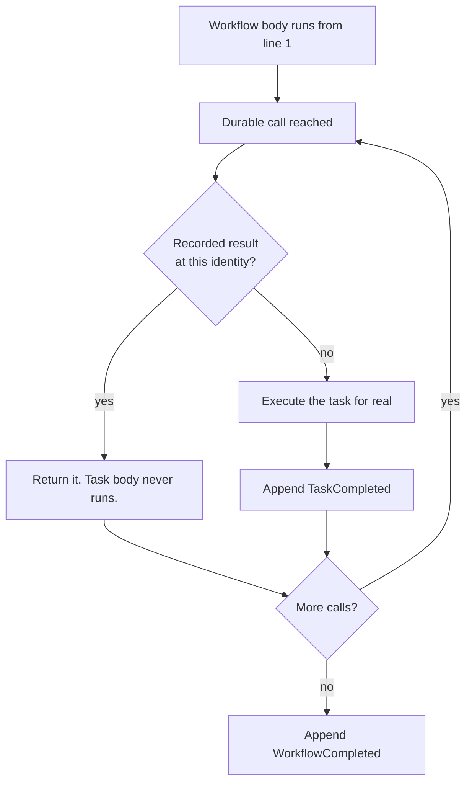

# Concepts

Three ideas carry the whole runtime: an append-only journal, replay from the top, and a
stable identity for every durable call. Once those click, the rest of Satay is detail.

## The journal

Every run owns an ordered, append-only list of events in SQLite. Nothing is ever updated or
deleted; new facts go on the end. The database is one file, `satay.db`, inside a
project-local `./.satay/` directory, opened in WAL mode.

```
./.satay/
  satay.db      the journal, timers, and the event inbox
  blobs/        payloads over 256 KiB, content-addressed
  dev.lock      held by `satay dev` while it runs
```

Override the location with `--data-dir` on the CLI or `SATAY_DATA_DIR` in the environment.
The schema is versioned with SQLite's `PRAGMA user_version` and migrated forward only; a
database written by a newer Satay than yours is refused rather than guessed at.

Events you will see, in the order a healthy two-task run produces them:

| Event | Means |
| --- | --- |
| `WorkflowCreated` | The run exists. Carries the input and a code-version stamp. |
| `TaskScheduled` | A durable call was issued for the first time. |
| `TaskAttemptStarted` | One physical attempt began. |
| `TaskAttemptFailed` | That attempt raised. Carries the error and the next backoff delay. |
| `TaskCompleted` | The task's result is now durable. This is the record replay reads. |
| `WorkflowCompleted` / `WorkflowFailed` | Terminal. |
| `WorkflowResumed` | A run came back from an interruption. Rendered with a `⚡`. |
| `TimerCreated` / `TimerFired` | A `satay.sleep` or an event-wait timeout. |
| `EventWaitStarted` / `ExternalEventReceived` | A `wait_for_event` and its delivery. |
| `WorkflowWaiting` | The run parked and gave up its frame. |
| `ChildWorkflowScheduled` | A `start_child` call. |
| `WorkflowCancelled`, `RunForked` | Cancellation and fork lineage. |

Payloads bigger than 256 KiB when encoded spill to a content-addressed file under
`blobs/` and the journal keeps a reference. This is transparent on both write and read, so
a task returning a large document behaves like any other.

## Replay from the top

There is no stack capture. On resume Satay calls your workflow function again from its first
line, and the replay engine intercepts each durable call as it comes:



Two consequences follow, and both matter.

Everything between durable calls re-runs on every resume. A `print`, a counter increment, a
log line in the workflow body happens again each time. Only the results of durable calls are
memoised, not the code around them.

And the body must issue the same calls in the same order, which is the
[determinism rule](determinism.md). It is not a style preference. It is what makes the
position matching above meaningful.

The trade is a good one for this problem. Replay from the top means the durable state is
plain readable rows rather than a pickled coroutine, that you can inspect a half-finished run
in Studio or with `sqlite3`, and that upgrading Python does not invalidate your in-flight work.

## Durable call identity

For a recorded result to answer the right call, each call site needs an identity that is the
same on the first pass and every replay. Satay has two forms.

### Ordinal identity

An ordinary durable call is identified by `(task_name, ordinal)`, where the ordinal counts
calls **per task name** within one drive. First `charge(...)` is `charge#0`, the second is
`charge#1`, and the first `email_receipt(...)` is `email_receipt#0`, not `#1`. Ordinals
restart at zero on every drive, which is exactly why the schedule has to be reproducible.

You saw this in the [quickstart](quickstart.md#read-the-journal) timeline: two different
tasks, both at `ordinal=0`.

Ordinals are implicit, which makes them fragile in one specific way. Insert a new call before
an existing one and every later call of that same task name shifts down a slot. For a run
that is already in flight, that is a divergence:

```python
# before
receipt = await charge(total)

# after: charge#0 is now the fee, and the journal's charge#0 result gets
# handed to the wrong call site
fee = await charge(processing_fee)
receipt = await charge(total)
```

Adding calls to workflows with no runs in flight is fine. Adding them while runs are parked
mid-flight is a migration, and Satay has no automatic migration. Fork the run instead, or let
it drain first.

### Keyed identity

Fan-out has no stable ordinal. The item count can change and completion order varies, so
`satay.map` requires an explicit `key=` and identifies each item as `(task_name, key)`:

```python
@satay.workflow
async def resize_all(paths: list[str]) -> list[str]:
    return await satay.map(resize, paths, key=lambda p: p)
```

The key must be a non-empty string, unique within that one `map`, and stable across replays.
A missing or duplicate key is a `ValueError` raised at schedule time, before any item runs.
Derive it from the item itself (an id, a path, a hash) and never from enumeration order or a
counter.

Keyed identities resolve independently of the ordinal counter, so inserting an ordinary call
elsewhere in the body never shifts a map item's identity. That is why a crash halfway through
a thousand-item fan-out resumes with the finished items reused and only the unresolved ones
re-run.

`satay.start_child` takes an optional `key=` too. Without one the child is identified by
ordinal like any other call; with one it survives reordering.

### The idempotency key

Each logical durable call also gets a stable idempotency key, derived as
`sha256(run_id, task_name, ordinal-or-map-key)`. Arguments are deliberately excluded, so the
key is identical across every retry of the same logical call and different for every other
call, task, item, and run.

A task body reads it with `satay.task_context()`, which is how you make an external effect
safe under at-least-once execution. That is covered on the [guarantees page](guarantees.md#idempotency-keys).

## Runs, handles, and status

`satay.start(...)` returns a `RunHandle` and does no work. `await handle.result()` drives the
run and returns its outcome, or raises `WorkflowFailedError` carrying the recorded error type,
message, and original traceback. That class is not re-exported from the top-level package
yet; import it from `satay.api.run_handle` if you need to catch it by type, or catch
`RuntimeError`, which it subclasses.

What `start` does depends on what it finds:

| You pass | The run is | What happens |
| --- | --- | --- |
| nothing | new | A fresh `run_id` is allocated and the run is created. |
| `run_id=` | known, unfinished | Resumed. `WorkflowResumed` is appended and it re-drives. |
| `run_id=` | known, terminal | No-op. The recorded result is returned. |
| `run_id=` | unknown | Treated as new, using the id you gave. |
| `idempotency_key=` | keyed, existing | Resolves to the same logical run instead of duplicating it. |

A run's status is one of `running`, `waiting`, `completed`, `failed`, or `cancelled`.
`waiting` is the interesting one: a run parked on a `satay.sleep` or a `wait_for_event` has no
live coroutine at all. It was released from memory, and something has to wake it. Waking is a
graceful resume, so it writes no `WorkflowResumed` and shows no `⚡`.

Because a parked run has no frame, `await handle.result()` on one returns `None` rather than
blocking forever. Check `await handle.status()` and call `result()` again once the worker has
moved it along. The [primitives page](primitives.md#running-the-worker) shows the pattern.
