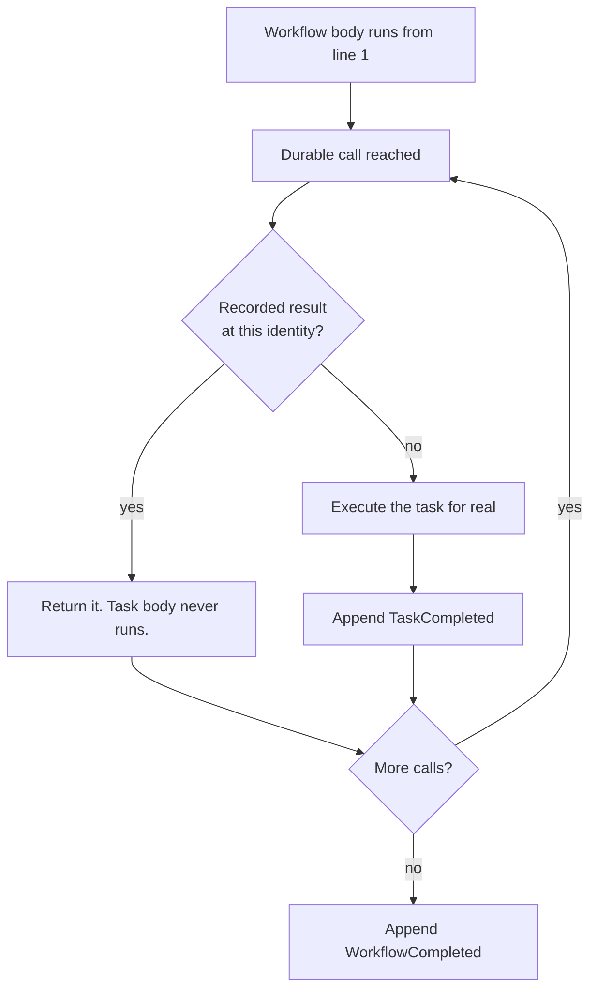

# Concepts

Three ideas carry the whole runtime: an append-only journal, replay from the top, and a stable
identity for every durable call. Once those click, the rest of Satay is detail.

## The journal

Every run owns an ordered, append-only list of events in SQLite. Nothing is ever updated or
deleted; new facts go on the end. The database is one file, `satay.db`, inside a project-local
`./.satay/` directory, opened in WAL mode.

```
./.satay/
  satay.db      the journal, timers, and the event inbox
  blobs/        payloads over 256 KiB, content-addressed
  dev.lock      held by `satay dev` while it runs
```

Override the location with `--data-dir` on the CLI or `SATAY_DATA_DIR` in the environment. The
schema is versioned with SQLite's `PRAGMA user_version` and migrated forward only. A database
written by a newer Satay than yours is refused rather than guessed at.

These are the events you will see, roughly in the order a healthy run produces them:

| Event | Means |
| --- | --- |
| `WorkflowCreated` | The run exists. Carries the input and a code-version stamp. |
| `TaskScheduled` | A durable call was issued for the first time. |
| `TaskAttemptStarted` | One physical attempt began. |
| `TaskAttemptFailed` | That attempt raised. Carries the error and the next backoff delay. |
| `TaskCompleted` | The task's result is now durable. This is the record replay reads. |
| `WorkflowCompleted` / `WorkflowFailed` | Terminal. |
| `WorkflowResumed` | A run came back from an interruption. Rendered with a `⚡`. |
| `TimerCreated` / `TimerFired` | A `satay.sleep` or an event-wait timeout. |
| `EventWaitStarted` / `ExternalEventReceived` | A `wait_for_event` and its delivery. |
| `WorkflowWaiting` | The run parked and gave up its frame. |
| `ChildWorkflowScheduled` | A `start_child` call. |
| `WorkflowCancelled`, `RunForked` | Cancellation and fork lineage. |

Payloads bigger than 256 KiB when encoded spill to a content-addressed file under `blobs/` and
the journal keeps a reference. This is transparent on both write and read, so a task returning a
large document behaves like any other.

## Replay from the top

There is no stack capture. On resume Satay calls your workflow function again from its first
line, and the replay engine intercepts each durable call as it comes:



Two consequences follow, and both matter.

**Everything between durable calls re-runs on every resume.** A `print`, a counter increment, or
a log line in the workflow body happens again each time. Only the results of durable calls are
memoised, not the code around them.

**The body must issue the same calls in the same order.** That is the
[determinism rule](determinism.md), and it is what makes the position matching above meaningful.

The trade is a good one for this problem. Replay from the top means durable state is plain
readable rows rather than a pickled coroutine, that you can inspect a half-finished run in Studio
or with `sqlite3`, and that upgrading Python does not invalidate your in-flight work.

## Durable call identity

For a recorded result to answer the right call, each call site needs an identity that is the same
on the first pass and on every replay. Satay has two forms.

### Ordinal identity

An ordinary durable call is identified by `(task_name, ordinal)`, where the ordinal counts calls
**per task name** within one drive. Try it. Put this in `twice.py`, which calls the same task
twice:

```python title="twice.py"
import asyncio

import satay


@satay.task()
async def charge(cents: int) -> str:
    return f"receipt-{cents}"


@satay.task()
async def email_receipt(receipt: str) -> str:
    return f"emailed {receipt}"


@satay.workflow
async def checkout(cents: int) -> str:
    fee = await charge(199)
    receipt = await charge(cents)
    return await email_receipt(f"{fee}+{receipt}")


asyncio.run(satay.start(checkout, 1999, run_id="twice-1").result())
```

Run it, then read the journal:

```console
$ python twice.py
$ satay runs show twice-1
Run twice-1 — 11 event(s)
    1  2026-07-31T07:57:40.428410+00:00  WorkflowCreated  workflow=checkout code_version=src:6d70e90dd85ad995
    2  2026-07-31T07:57:40.433181+00:00  TaskScheduled  task=charge ordinal=0
    3  2026-07-31T07:57:40.437840+00:00  TaskAttemptStarted  task=charge ordinal=0 attempt=1
    4  2026-07-31T07:57:40.442742+00:00  TaskCompleted  task=charge ordinal=0
    5  2026-07-31T07:57:40.447897+00:00  TaskScheduled  task=charge ordinal=1
    6  2026-07-31T07:57:40.452453+00:00  TaskAttemptStarted  task=charge ordinal=1 attempt=1
    7  2026-07-31T07:57:40.457041+00:00  TaskCompleted  task=charge ordinal=1
    8  2026-07-31T07:57:40.461873+00:00  TaskScheduled  task=email_receipt ordinal=0
    9  2026-07-31T07:57:40.466547+00:00  TaskAttemptStarted  task=email_receipt ordinal=0 attempt=1
   10  2026-07-31T07:57:40.471158+00:00  TaskCompleted  task=email_receipt ordinal=0
   11  2026-07-31T07:57:40.475807+00:00  WorkflowCompleted
```

There it is: `charge ordinal=0`, then `charge ordinal=1`, then `email_receipt ordinal=0`. The
counter is per task name, so `email_receipt` starts at zero even though two calls came before it.
Ordinals also restart at zero on every drive, which is exactly why the schedule has to be
reproducible.

Ordinals are implicit, and that makes them fragile in one specific way. Insert a new call before
an existing one and every later call of that same task name shifts down a slot. For a run that is
already in flight, that is a divergence:

```python
# before
receipt = await charge(total)

# after: charge#0 is now the fee, and the journal's charge#0 result gets
# handed to the wrong call site
fee = await charge(processing_fee)
receipt = await charge(total)
```

Adding calls to workflows with no runs in flight is fine. Adding them while runs are parked
mid-flight is a migration, and Satay has no automatic migration. Fork the run instead, or let it
drain first.

### Keyed identity

Fan-out has no stable ordinal. The item count can change and completion order varies, so
`satay.map` requires an explicit `key=` and identifies each item as `(task_name, key)`:

```python
@satay.workflow
async def resize_all(paths: list[str]) -> list[str]:
    return await satay.map(resize, paths, key=lambda p: p)
```

The key must be a non-empty string, unique within that one `map`, and stable across replays. A
missing or duplicate key is a `ValueError` raised at schedule time, before any item runs. Derive
it from the item itself (an id, a path, a hash) and never from enumeration order or a counter.

Keyed identities resolve independently of the ordinal counter, so inserting an ordinary call
elsewhere in the body never shifts a map item's identity. That is why a crash halfway through a
thousand-item fan-out resumes with the finished items reused and only the unresolved ones re-run.

`satay.start_child` takes an optional `key=` too. Without one the child is identified by ordinal
like any other call; with one it survives reordering.

### The idempotency key

Each logical durable call also gets a stable idempotency key, derived as
`sha256(run_id, task_name, ordinal-or-map-key)`. Arguments are deliberately excluded, so the key
is identical across every retry of the same logical call and different for every other call,
task, item, and run.

A task body reads it with `satay.task_context()`, which is how you make an external effect safe
under at-least-once execution. That is covered in
[Guarantees](guarantees.md#idempotency-keys).

Note the `run_id` in that formula, and note that the key names a *call*. Both have consequences
for what the key deduplicates and what it quietly does not:
[What the key does not cover](guarantees.md#what-the-key-does-not-cover).

## Runs, handles, and status

`satay.start(...)` returns a `RunHandle` and does no work. `await handle.result()` drives the run
and returns its outcome, or raises `satay.WorkflowFailedError` carrying the recorded error type,
message, and original traceback. It subclasses `RuntimeError`, so catching that works too, but
the specific type is the one to reach for:

```python
from satay import WorkflowFailedError

try:
    total = await handle.result()
except WorkflowFailedError as exc:
    print(exc.error_type, exc.error_message, exc.traceback_str)
```

A failed run stays failed. Nothing retries it for you beyond the task's own retry budget:

```python title="doomed.py"
import asyncio

import satay
from satay import WorkflowFailedError


@satay.task()
async def charge(cents: int) -> str:
    raise ValueError("card declined")


@satay.workflow
async def doomed(cents: int) -> str:
    return await charge(cents)


async def main() -> None:
    handle = satay.start(doomed, 1999, run_id="doomed-2")
    try:
        await handle.result()
    except WorkflowFailedError as exc:
        print(f"{exc.error_type}: {exc.error_message}")
    print("status:", await handle.status())


asyncio.run(main())
```

```console
$ python doomed.py
ValueError: card declined
status: failed
```

What `start` does depends on what it finds:

| You pass | The run is | What happens |
| --- | --- | --- |
| nothing | new | A fresh `run_id` is allocated and the run is created. |
| `run_id=` | known, unfinished | Resumed. `WorkflowResumed` is appended and it re-drives. |
| `run_id=` | known, terminal | No-op. The recorded result is returned. |
| `run_id=` | unknown | Treated as new, using the id you gave. |
| `idempotency_key=` | keyed, existing | Resolves to the same logical run instead of duplicating it. |

A run's status is a `satay.RunStatus` — one of `running`, `waiting`, `completed`, `failed`, or
`cancelled`. It is a `StrEnum`, so `await handle.status() == "completed"` and
`is satay.RunStatus.COMPLETED` both work, and it prints as the bare word above. `waiting` is
the interesting one: a run parked on a `satay.sleep` or a `wait_for_event` has no live coroutine
at all. It was released from memory, and something has to wake it. Waking is a graceful resume, so
it writes no `WorkflowResumed` and shows no `⚡`.

A parked run has no frame, so what `await handle.result()` does depends on whether anything in
your process is going to wake it. Inside `async with satay.run_app() as store:` there is a poll
loop, and `result()` waits for it and hands you the real outcome. Without one it returns
`satay.PARKED` — a sentinel, not `None`, so it cannot be mistaken for a workflow that returned
`None` on purpose. [The Five Primitives](primitives.md#running-the-worker) shows both.

## Recap

- The journal is append-only SQLite. `TaskCompleted` is the record replay reads.
- Replay re-executes your workflow body from line one and answers durable calls from the journal.
  Code between those calls runs again every time.
- Ordinary calls are identified by `(task_name, ordinal)`, counted per task name and reset on
  every drive. `map` items are identified by `(task_name, key)` and survive reordering.
- Every logical call has an idempotency key that is stable across retries.
- `satay.start` is a plain function. `await handle.result()` does the work, and raises
  `WorkflowFailedError` on a failed one. On a parked run it waits for the poll loop if
  `satay.run_app` is running one, and returns `satay.PARKED` — not `None` — if nothing will.

## Next

[The Determinism Rule](determinism.md). Ordinals only work if your workflow body issues the same
calls in the same order, and the next page is about what happens when it does not.
