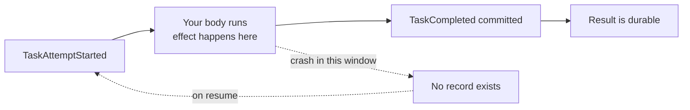

# Guarantees

Satay executes tasks **at least once**. Not exactly once, because exactly-once execution of an
effect that leaves the process is not something a runtime can promise. What it gives you instead is
a stable key you can build exactly-once semantics on top of, plus a policy that shouts when you
have not.

## Retries and backoff

A task declares its own retry budget:

```python
@satay.task(retries=2, timeout=30)
async def fetch(url: str) -> dict:
    ...
```

`retries=2` means up to three physical attempts. Each failure appends `TaskAttemptFailed` carrying
the error and the delay before the next try, then the executor waits and appends a fresh
`TaskAttemptStarted`. Exhausting the budget re-raises the last error, which becomes
`WorkflowFailed`.

The delay is capped exponential backoff with full jitter. The ceiling for failure *n* is
`min(60, 1 × 2^(n-1))` seconds, and the actual wait is drawn uniformly from zero to that ceiling.

| Failure | Ceiling | Actual wait |
| --- | --- | --- |
| 1 | 1s | random in [0, 1] |
| 2 | 2s | random in [0, 2] |
| 3 | 4s | random in [0, 4] |
| 4 | 8s | random in [0, 8] |
| 7 and beyond | 60s | random in [0, 60] |

Full jitter rather than fixed backoff, so a hundred tasks failing on the same downstream outage do
not retry in lockstep. Both the clock and the RNG are injected, which is how a test
[replays a retry schedule with no real delay](tutorial/testing.md#pin-the-backoff-jitter).

`timeout` is per attempt, in seconds. Exceeding it cancels the task body and fails that attempt
with `TimeoutError`, which then counts against the retry budget like any other failure.

One subtlety in the resume path: only **recorded** failures consume retry budget. If the process
dies between your effect landing and `TaskCompleted` being written, the resumed attempt number goes
up but the budget does not shrink. A crash is not a failure.

## At-least-once, concretely

A task body can run more than once for a single logical call. Two ways:

- A retry, after the body raised.
- A crash between the body finishing its work and `TaskCompleted` reaching disk.

The second one is the awkward case, because from inside the task nothing looks wrong. The charge
went through, the email went out, and then the power went off before the journal learned about it.
On resume there is no recorded result, so the task runs again.



That window is narrow and it is unavoidable. Which is why the key exists.

## Idempotency keys

Every logical durable call has a stable key, `sha256(run_id, task_name, ordinal-or-map-key)`.
Arguments are excluded on purpose: the key is **identical across retries of the same call** and
**different for every other call**, item, and run.

Read it inside a task with `satay.task_context()`:

```python
@satay.task(side_effect=True, retries=2, idempotent=True)
async def charge(cents: int) -> str:
    ctx = satay.task_context()
    if await already_charged(ctx.idempotency_key):
        return await recorded_receipt(ctx.idempotency_key)
    return await payments.charge(cents, idempotency_key=ctx.idempotency_key)
```

Two ways to use it, and both are legitimate. Pass it to a downstream API that accepts an
idempotency key of its own, which every payment provider does. Or record it yourself in a table and
check before acting.

`ctx` also carries `run_id`, `task_name`, `ordinal`, and `attempt`. Put `attempt` in your log
lines, because "this is attempt 3" explains a lot.

## `effect_safety`

The runtime cannot tell whether your task talks to the outside world, so you tell it:

```python
@satay.task(side_effect=True, retries=2, idempotent=True)
```

`side_effect=True` says this task does something the world notices. `idempotent=True` is a promise
that you have keyed that effect on `ctx.idempotency_key`. A task that is side-effecting **and**
retryable **and** not declared idempotent is the dangerous combination, and `effect_safety` is what
happens when the runtime spots one:

| Mode | Behaviour |
| --- | --- |
| `off` | Silent. |
| `warn` | Logs a warning and runs it. The default. |
| `strict` | Refuses at schedule time with `EffectSafetyError`. |

Resolution order is the `effect_safety=` argument to `satay.start`, then `SATAY_EFFECT_SAFETY` in
the environment, then `warn`.

`warn` is the default here because the flagged combination is a design smell rather than a present
bug: the task may well be safe, the runtime just cannot tell. Promote it to `strict` in any
environment where you would rather be told at schedule time than find out from a duplicate charge.

!!! note "This setting does not cover replay divergence"

    Replay divergence has its own knob, the
    [nondeterminism policy](determinism.md#opting-out-while-you-iterate), which defaults to
    `strict`. The two used to be one setting; they were split because a divergence is a live wrong
    answer while an unguarded effect is a risk, and one default cannot serve both. Changing one has
    no effect on the other. The [code-version stamp](studio.md#the-code-version-stamp) is a third
    independent policy.

## See all three

```python title="guarantees.py"
import asyncio

import satay

attempts = 0
charged: set[str] = set()


@satay.task(retries=2)
async def flaky(n: int) -> int:
    global attempts
    attempts += 1
    print(f"  flaky: attempt {attempts}")
    if attempts < 3:
        raise RuntimeError("transient")
    return n * 2


@satay.workflow
async def with_retries(n: int) -> int:
    return await flaky(n)


@satay.task(side_effect=True, retries=2, idempotent=True)
async def charge(cents: int) -> str:
    ctx = satay.task_context()
    if ctx.idempotency_key in charged:
        print(f"  charge: already applied (attempt {ctx.attempt}), skipping the effect")
    else:
        charged.add(ctx.idempotency_key)
        print(f"  charge: applying the effect (attempt {ctx.attempt})")
    if ctx.attempt == 1:
        raise RuntimeError("the network died after the charge went through")
    return f"receipt-{cents}"


@satay.workflow
async def guarded(cents: int) -> str:
    return await charge(cents)


@satay.task(side_effect=True, retries=1)
async def unguarded(cents: int) -> str:
    return f"receipt-{cents}"


@satay.workflow
async def unsafe(cents: int) -> str:
    return await unguarded(cents)


async def main() -> None:
    print("retries:")
    print("  ->", await satay.start(with_retries, 21).result())

    print("idempotency key:")
    print("  ->", await satay.start(guarded, 1999).result())
    print(f"  -> the effect ran {len(charged)} time(s)")

    print("effect_safety=strict:")
    try:
        await satay.start(unsafe, 500, effect_safety="strict").result()
    except satay.EffectSafetyError as exc:
        print(f"  -> {type(exc).__name__}: {exc}")


asyncio.run(main())
```

```console
$ python guarantees.py
retries:
  flaky: attempt 1
  flaky: attempt 2
  flaky: attempt 3
  -> 42
idempotency key:
  charge: applying the effect (attempt 1)
  charge: already applied (attempt 2), skipping the effect
  -> receipt-1999
  -> the effect ran 1 time(s)
effect_safety=strict:
  -> EffectSafetyError: effect_safety=strict rejects task 'unguarded': it is side-effecting and retryable but declares no idempotency or compensation strategy. Set @task(idempotent=True) or accept a ctx parameter and guard the effect with ctx.idempotency_key.
```

The middle block is the one to stare at. `charge` ran twice, the effect happened once, and the key
is what made the difference. In real code `charged` would be a database table rather than a `set`,
since a `set` does not survive the process it lives in.

## Redaction

Every read through the HTTP API and Studio passes through a redactor before it leaves the process.
Any field whose name contains `password`, `passwd`, `secret`, `token`, `api_key`, `apikey`,
`access_key`, `accesskey`, `private_key`, `credential`, `authorization`, or `session_token` has its
value replaced with `***REDACTED***`, recursively through nested structures.

The list is deliberately narrow so structural keys survive: a `map` item's `key`, plus
`code_version`, `event_id`, and `identity`, are never caught.

By default this happens **on read**, so the raw value is still in `satay.db`. It stops a secret
being rendered in a browser tab. It is not encryption at rest.

### Redacting on write instead

For a local debugger, read-time is the right place: the database never leaves your machine. Once a
journal is shipped somewhere else — a shared box, a backup, an ingest endpoint — the read path is
protecting the wrong thing, because whoever holds the file holds the secret.

So there is a second mode that redacts on the way *in*:

```bash
SATAY_WRITE_REDACTION=on            # or SQLiteStore.open(path, write_redaction="on")
```

It is **off by default**, and turning it on changes something real: the value is gone. Not hidden
behind a filter — never written. A task result recorded as `***REDACTED***` is what a replayed call
hands back, and a redacted workflow input is what a resumed or forked run is re-entered with.

```python title="credentials.py"
@satay.task()
async def issue_credentials(label: str) -> dict:
    return {"api_key": "sk-live-...", "label": label}
```

| | `SATAY_WRITE_REDACTION` unset | `=on` |
| --- | --- | --- |
| in `satay.db` | `{"api_key": "sk-live-...", ...}` | `{"api_key": "***REDACTED***", ...}` |
| in a spilled blob | the raw value, under a hash | nothing — redaction runs before spill |
| in the API response | `***REDACTED***` | `***REDACTED***` |
| on replay, the call returns | the raw value | `***REDACTED***` |

Replay itself is unaffected. Only the **value slots** are redacted: every journal field whose name
ends in `_ref` (`input_ref`, `output_ref`, `event_ref`, a fork's `source_input_ref`) plus a
`send_event` payload. A durable call's identity is its `(task_name, ordinal)` or `(task_name, key)`,
and those are never touched, so a redacted journal resolves exactly the same calls in the same
order. That holds even if you pass a pattern set aimed straight at them.

One field is deliberately left alone: the `error` on a recorded failure. In collect mode a
`TaskFailed` is read back on replay, and its `error_type` is what your `except` branch sees on
every pass — rewriting it would make the first run and the replay disagree. Its three fields are
generated by the runtime, so there is nothing there for a field-name rule to catch anyway.

The sharp edge is workflow input. It is the one redactable value that is also a *seed*: the poll
loop and `fork` both re-enter a workflow from its recorded input, so a redacted one comes back as
the placeholder and your workflow computes from that. `satay.fork(..., workflow_input=...)` is
redacted on the way in for the same reason — the override is written into the fork's journal, not
passed at drive time. Satay logs a warning naming the run when it happens. The fix is a shape, not
a setting — fetch the secret inside a task, or pass it per-task, rather than threading it through
the workflow signature.

Two things it still does not do. A secret with no field name to match — a bare string argument, or
one interpolated into an exception message that reaches a traceback — survives in both modes; this
is field-name matching, not content scanning. And everything unmatched is stored verbatim, so
neither mode is encryption at rest.
