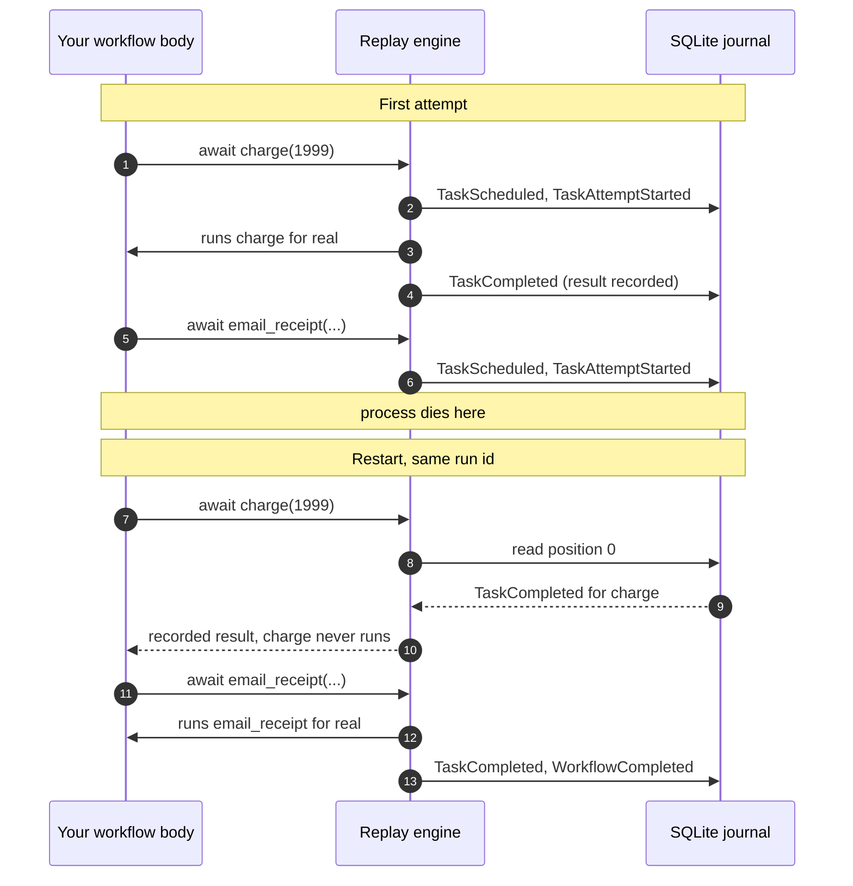

# Satay Runtime

Satay is a durable-execution runtime for async Python that runs on your laptop. You write
ordinary `async def` functions; Satay records every durable call to an append-only SQLite
journal, and when the process dies it **replays the workflow from the top**, handing back
the recorded results instead of re-running the work that already finished.

No broker, no scheduler, no control plane to operate. One process and one SQLite file.

```python
import satay

@satay.task()
async def charge(cents: int) -> str:
    return f"receipt-{cents}"

@satay.task()
async def email_receipt(receipt: str) -> str:
    return f"emailed {receipt}"

@satay.workflow
async def checkout(cents: int) -> str:
    receipt = await charge(cents)
    return await email_receipt(receipt)
```

Kill that process after `charge` commits and start it again with the same run id. `charge`
does not run a second time. Its result comes back from the journal, and execution picks up
at `email_receipt`. The [quickstart](quickstart.md) walks you through doing exactly that,
with a real `Ctrl-C` in the middle.

!!! warning "Alpha software"

    `satay 0.1.0a1` is the first published release. It works and the test suite is green,
    but the API can still move between alpha versions, and there is no deprecation policy
    yet. Pin the exact version if you build on it. The [limits page](limits.md) lists what
    is deliberately missing.

## Install

```bash
pip install satay              # the runtime core: one package, zero dependencies
pip install 'satay[studio]'    # adds the debugger UI and the HTTP API
```

The core install really is dependency-free. That is the packaging promise, and it is why
you can embed Satay in an application without dragging FastAPI, uvicorn, and a JavaScript
bundle into production. Studio lives behind the `[studio]` extra, where it belongs.

## What replay actually means



The workflow body runs from the first line every single time. Satay does not snapshot your
stack or pickle a coroutine. It re-executes the function and intercepts each durable call,
answering from the journal when a matching record exists and executing for real when it
does not. That design has one cost, and it is the thing you have to internalise: the
workflow body has to be [deterministic](determinism.md).

## Where to go next

<div class="grid cards" markdown>

-   **[Quickstart](quickstart.md)**

    Install, write a two-task workflow, kill it mid-run, watch it resume.

-   **[The determinism rule](determinism.md)**

    The one rule that makes replay work, and what breaking it looks like.

-   **[Concepts](concepts.md)**

    The journal, replay from the top, and how a call keeps its identity.

-   **[The five primitives](primitives.md)**

    `sleep`, `wait_for_event`/`send_event`, `map`, `gather`, `start_child`.

-   **[Guarantees](guarantees.md)**

    Retries, at-least-once, idempotency keys, and `effect_safety`.

-   **[Studio and `satay dev`](studio.md)**

    The local debugger, and the token handling that trips everyone up.

</div>

## Requirements

Python 3.12 or 3.13. Linux and macOS are first class. Windows is best effort: the
cross-process data-directory lock uses POSIX `flock` and degrades to a no-op elsewhere.
SQLite on a network filesystem is not supported.
