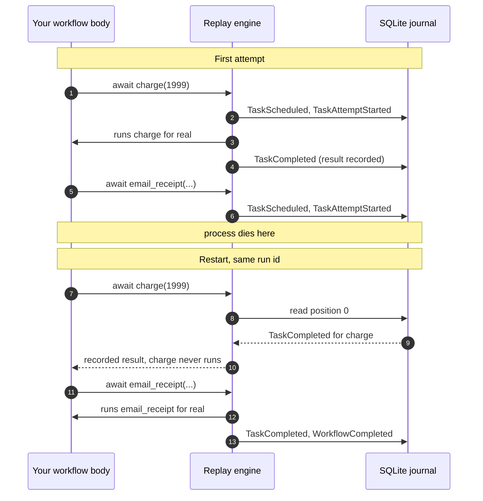

# Satay Runtime

**Durable execution for async Python, on your laptop.**

Satay records every durable call your workflow makes to an append-only SQLite journal. When
the process dies, the workflow **replays from the top** and the calls that already finished
hand back their recorded results instead of running again.

No broker, no scheduler, no control plane to operate. One process and one SQLite file.

## Key Features

- **Crash recovery you can watch.** Kill the process mid-run, start it again with the same run
  id, and the task that already committed does not execute a second time.
- **Ordinary functions.** You write `async def`. There is no DSL, no YAML, no step registry.
- **Zero dependencies in the core.** `pip install satay` puts exactly one package in your
  environment. FastAPI, uvicorn, and the debugger UI live behind the `[studio]` extra.
- **A readable journal.** Durable state is SQLite rows you can query with `sqlite3`, not a
  pickled coroutine. Upgrading Python does not invalidate work in flight.
- **A local debugger.** Studio gives you the event timeline, the execution tree, per-attempt
  detail, a two-run comparison, and a fork button.
- **Strict by default where it counts.** A replay that issues a different call than the journal
  recorded raises instead of quietly returning a wrong answer.
- **A real test seam.** `ManualClock`, `SeededRng`, and `FaultInjector` let a test crash a
  workflow on purpose and skip a fourteen-day timer with no wall-clock waiting.

!!! warning "Alpha software"

    `satay 0.1.0a1` is the first published release. The runtime works and its suite is green,
    but the API can still move between alpha versions and nothing is deprecated gracefully
    yet. Pin the exact version if you build on it. [Limits](limits.md) lists what is
    deliberately missing.

    These docs also describe `main`, which is ahead of the published alpha in five places,
    including the strict nondeterminism default in the list above. The
    [install note](tutorial/index.md#install) says which, and how to get a build that
    matches.

## Requirements

Python 3.12 or 3.13. Linux and macOS are first class. Windows is best effort: the
cross-process data-directory lock uses POSIX `flock` and degrades to a no-op elsewhere. SQLite
on a network filesystem is not supported.

## Installation

```console
$ pip install satay
Successfully installed satay-0.1.0a1
```

That is the whole install. `satay` declares no runtime dependencies, so `pip list` in a
fresh environment shows `satay` and nothing else. The debugger and the HTTP API are an opt-in:

```bash
pip install 'satay[studio]'    # adds fastapi, uvicorn, pydantic, typer
```

## Example

### Create It

Copy this into `checkout.py`. Two tasks and one workflow, plus a switch that kills the process
in the middle of the second task.

```python title="checkout.py"
import asyncio
import os
import sys

import satay


@satay.task()
async def charge(cents: int) -> str:
    print("  charge: running for real")
    return f"receipt-{cents}"


@satay.task()
async def email_receipt(receipt: str) -> str:
    print("  email_receipt: running for real")
    if os.environ.get("CRASH"):
        print("  email_receipt: pulling the plug", flush=True)
        os._exit(1)  # no cleanup, no exception handling. A power cut.
    return f"emailed {receipt}"


@satay.workflow
async def checkout(cents: int) -> str:
    receipt = await charge(cents)
    return await email_receipt(receipt)


async def main() -> None:
    handle = satay.start(checkout, 1999, run_id=sys.argv[1])
    print(f"result: {await handle.result()}")


asyncio.run(main())
```

### Run It

Run it with the switch on, so it dies after `charge` has committed its result:

```console
$ CRASH=1 python -u checkout.py order-1
  charge: running for real
  email_receipt: running for real
  email_receipt: pulling the plug
```

`os._exit(1)` skips every exception handler, every `finally`, and every atexit hook. Nothing
got a chance to tidy up, which is the point.

### Check It

Now run it again with the same run id and no switch:

```console
$ python -u checkout.py order-1
  email_receipt: running for real
result: emailed receipt-1999
```

Look at what is missing. `charge: running for real` did not print. The workflow body ran from
its first line again, but when it reached `await charge(1999)` the engine found a recorded
result at that position and returned it without calling your function. `email_receipt` had no
recorded result, so it ran for real and the run completed.

If `charge` talks to a payment provider, that missing line is the difference between charging
once and charging twice.

### Read the Journal

```console
$ satay runs show order-1
Run order-1 — 10 event(s)
    1  2026-07-31T07:43:08.212535+00:00  WorkflowCreated  workflow=checkout code_version=src:0006d6eebf64908e
    2  2026-07-31T07:43:08.217803+00:00  TaskScheduled  task=charge ordinal=0
    3  2026-07-31T07:43:08.222832+00:00  TaskAttemptStarted  task=charge ordinal=0 attempt=1
    4  2026-07-31T07:43:08.228922+00:00  TaskCompleted  task=charge ordinal=0
    5  2026-07-31T07:43:08.234627+00:00  TaskScheduled  task=email_receipt ordinal=0
    6  2026-07-31T07:43:08.240206+00:00  TaskAttemptStarted  task=email_receipt ordinal=0 attempt=1
⚡   7  2026-07-31T07:43:08.323503+00:00  WorkflowResumed
    8  2026-07-31T07:43:08.329455+00:00  TaskAttemptStarted  task=email_receipt ordinal=0 attempt=2
    9  2026-07-31T07:43:08.333874+00:00  TaskCompleted  task=email_receipt ordinal=0
   10  2026-07-31T07:43:08.338199+00:00  WorkflowCompleted
```

The whole story is in there. `charge` was scheduled, attempted, completed. `email_receipt` was
scheduled and attempted, and then the log stops: that is where the process died. The `⚡` marks
`WorkflowResumed`. `email_receipt` gets `attempt=2` on the same `ordinal=0`, because it is the
same logical task making a second physical attempt. `charge` never appears again.

## How Replay Works



There is no stack capture and no pickled coroutine. Satay re-executes your function and
intercepts each durable call, answering from the journal when a matching record exists and
executing for real when it does not.

That design has one cost, and it is the thing to internalise before you write a third
workflow: the workflow body has to be [deterministic](determinism.md).

## Recap

You installed one package, wrote two tasks and a workflow, killed the process after the first
task committed, and watched the resumed run skip it. That is the whole product. Everything
else in these docs is about the cases where it gets harder: retries, timers, external events,
fan-out, and the one rule that keeps replay honest.

## Where to Go Next

<div class="grid cards" markdown>

-   **[Tutorial - User Guide](tutorial/index.md)**

    The sequence, read in order. Start at First Steps and each page adds one idea.

-   **[Cookbook](cookbook/index.md)**

    Complete programs for the shapes you will actually build.

-   **[The Determinism Rule](determinism.md)**

    The one rule that makes replay work, and what breaking it looks like.

-   **[Testing Workflows](tutorial/testing.md)**

    Crash a workflow in a unit test and skip a fourteen-day sleep.

-   **[Guarantees](guarantees.md)**

    Retries, at-least-once, idempotency keys, and `effect_safety`.

-   **[Studio and `satay dev`](studio.md)**

    The local debugger, and the token handling that trips everyone up.

</div>
